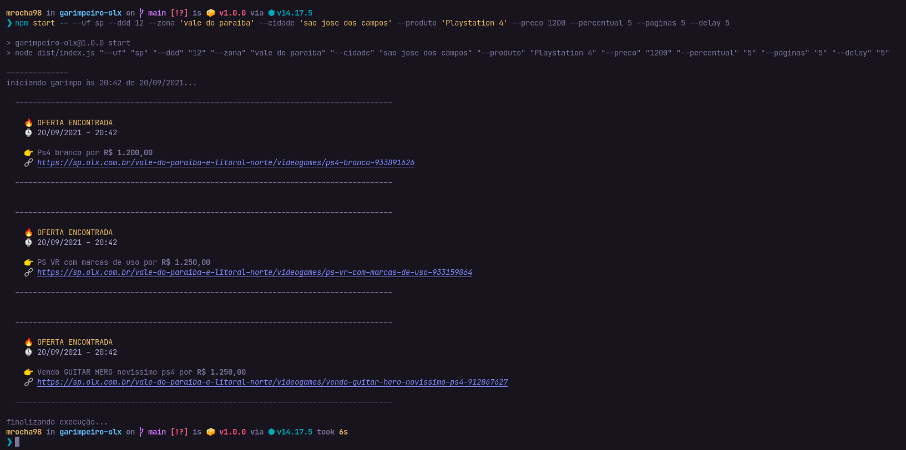
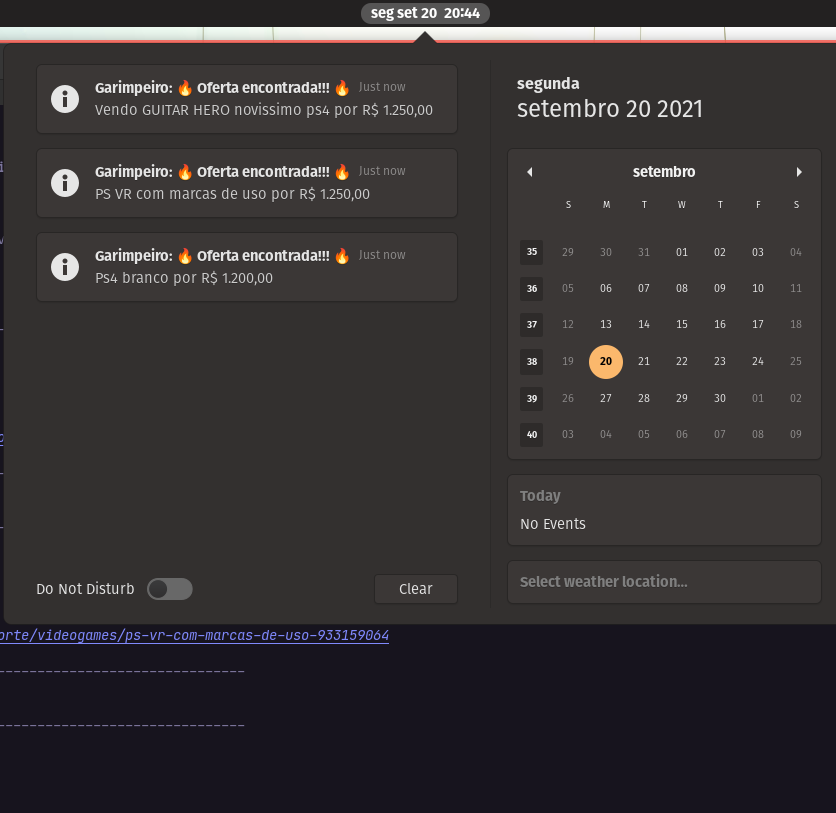
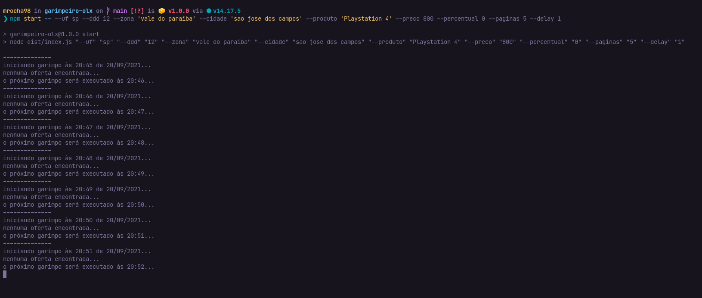
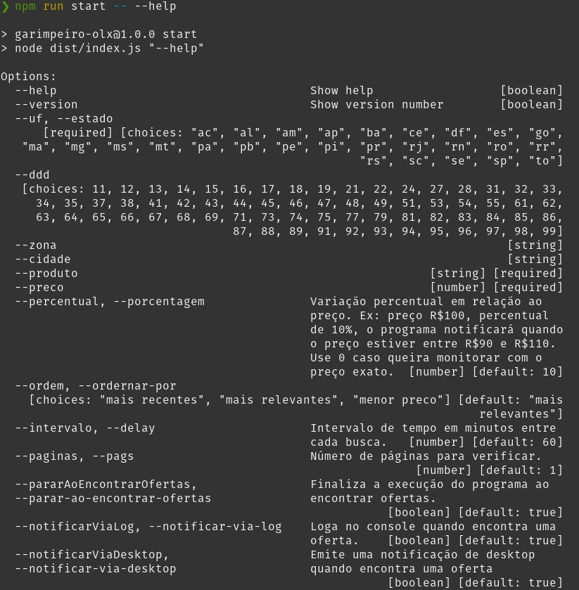

<h1 align="center">Garimpeiro OLX</h1>
<p align="center">Procurando por algo na <i>OLX</i>? Seja avisado do <b>melhor preço</b>!</p>
<br />

## 👀 Demonstração

<figure>
  
  <figcaption align="center">Notificação de oferta via log</figcaption>
</figure>

<figure>
  
  <figcaption align="center">Notificação de oferta via desktop (Linux)</figcaption>
</figure>

<figure>
  
  <figcaption align="center">Loop enquanto não encontra ofertas</figcaption>
</figure>


## ⚠ Requisitos

Instale o [NodeJS](https://nodejs.dev/download) em uma versão igual ou superior a 14.x. Se estiver utilizando Linux, certifique-se de ter o pacote `notify-osd` ou `libnotify-bin` para que as notificações Desktop funcionem (mais detalhes [aqui](https://github.com/mikaelbr/node-notifier#requirements)).

## 📥 Instalação

Clone o repositório/extraia o zip no local de sua preferência.

Em um terminal/prompt de comando, navegue até o repositório execute:

```sh
cd caminho-do-repo
npm install
npm run build
```

## 🤖 Utilização

Consulte os comandos disponíveis executando:

```sh
npm start -- --help
```

<figure>
  
  <figcaption align="center">Lista de comandos</figcaption>
</figure>

Tendo conhecimento das opções, basta combiná-las como se você estivesse fazendo uma busca no site da OLX.

Exemplo:

```sh
npm start -- --uf sp --ddd 12 --zona 'vale do paraiba' --cidade 'sao jose dos campos' --produto apartamento --preco 1
```

Resulta em uma busca na URL:

<https://sp.olx.com.br/vale-do-paraiba-e-litoral-norte/vale-do-paraiba/sao-jose-dos-campos?q=apartamento>


## 📄 Licença e CopyLeft

Esse projeto segue a [licença AGPL 3.0 ou superior](https://github.com/mrocha98/garimpeiro-olx/blob/main/LICENSE). Em resumo, você é livre para fazer o que quiser com o código fonte, desde que distribua suas modificações sob a mesma licença.

Obs: Eu sou um programador, não um advogado.


## 🤝 Contribuições

Caso tenha sugestões ou dúvidas abra um [issue](https://github.com/mrocha98/garimpeiro-olx/issues).

Se gostou do projeto considere contribuir com um pull request e tenha a honra de preencher itens dessa lista:
### TODO

- [ ] novos meios de notificação
  - [ ] SMS
  - [ ] Email
  - [ ] Whatsapp ([venom bot](https://github.com/orkestral/venom))
- [ ] bot no telegram
- [ ] cache
  - [ ] status das urls
  - [ ] preço máximo e mínimo
- [ ] testes unitários
- [ ] melhorar a documentação
  - [ ] mais exemplos
  - [ ] prints de notificações desktop em Windows e OSX
- [ ] interface gráfica?


